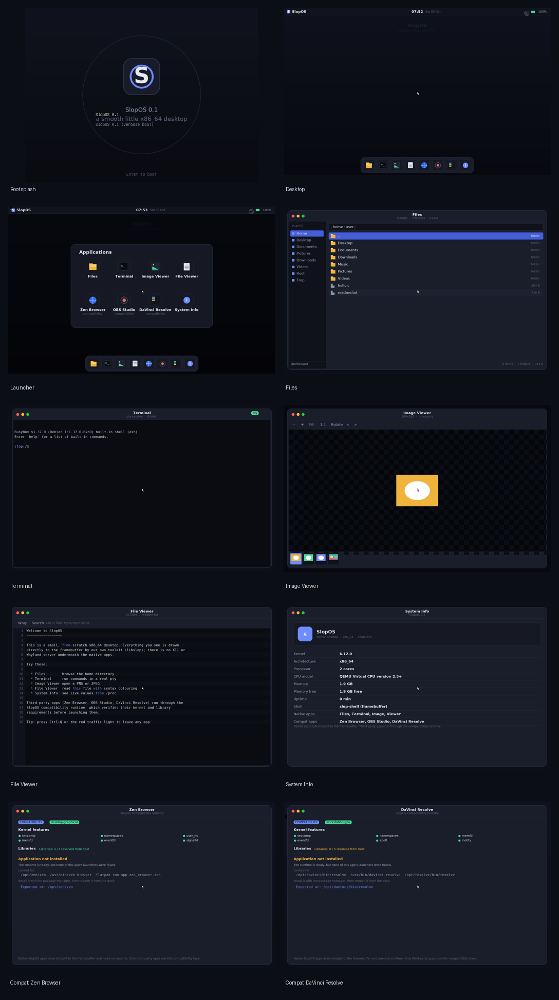

# SlopOS

A small, from-scratch **x86_64 desktop operating system**. It boots on real
hardware and in QEMU, draws its own polished interface straight to the
framebuffer, and runs the three third-party desktop apps people actually
want — **Zen Browser**, **OBS Studio** and **DaVinci Resolve** — through a
dedicated compatibility runtime.



## What you get

| App | What it does |
|-----|--------------|
| **Files** | Browse the home directory, open files in the right viewer |
| **Terminal** | A real PTY-backed terminal with an ANSI/CSI emulator |
| **Image Viewer** | PNG/JPEG/BMP/GIF with pan, zoom and a filmstrip |
| **File Viewer** | Text/code viewer with syntax colouring and search |
| **System Info** | Live values read from `/proc` and `/sys` |
| **Zen Browser** | Gecko web browser, via the compatibility runtime |
| **OBS Studio** | Screen recording and streaming, via the runtime |
| **DaVinci Resolve** | Video editing, via the runtime |

Plus a desktop shell with a top panel (menu, live clock, status), a dock, a
launcher grid, toasts, and a boot splash.

## Quick start

```sh
# Build everything and produce a bootable ISO
make all            # kernel + userland + rootfs + dist/slopos.iso

# Boot it (needs a display; falls back to headless capture)
make run

# Or run a specific step
make kernel         # build Linux 6.12 for x86_64
make user           # build libslop, the shell, apps and the runtime
make image          # assemble the rootfs + initramfs
make iso            # pack a hybrid BIOS+UEFI ISO
make shots          # boot once per app and capture screenshots
make verify-compat  # prove the third-party launch path end to end
```

The ISO is `dist/slopos.iso` (~35 MB). It boots on BIOS and UEFI machines;
the same image also works as a USB stick (`dd` it to a device).

### Requirements

`gcc`, `ld`, `nasm`, `flex`, `bison`, `pahole`, `bc`, `cpio`, `busybox-static`,
`grub-mkrescue`, `xorriso`, `mtools`, `qemu-system-x86_64`, `python3` and
`Pillow` (for fonts and sample images). On Debian/Ubuntu:

```sh
sudo apt-get install build-essential nasm flex bison pahole bc cpio \
     busybox-static grub-pc-bin grub-efi-amd64-bin xorriso mtools \
     qemu-system-x86 python3-pil
```

## How it works

SlopOS is deliberately split into two worlds.

```
        native world                     compatibility world
  +-------------------------+      +-----------------------------+
  |  shell + native apps    |      |  Zen / OBS / DaVinci        |
  |  draw to /dev/fb0       |      |  ordinary Linux ELF programs |
  |  via libslop            |      |  glibc + X11/Wayland + GPU   |
  +------------+------------+      +--------------+--------------+
               |                                  |
               +------------- /init --------------+
                                |
                    Linux 6.12 kernel (x86_64)
```

**Native apps need no compatibility layer.** They link `libslop` and paint
into a memory-mapped framebuffer. There is no X server or Wayland compositor
under the shell, so the desktop starts instantly and never tears.

**Third-party apps are the only things that use the compatibility runtime.**
Zen, OBS and Resolve are unmodified Linux programs that expect glibc, X11,
audio and GPU access. `slop-launch` reads a manifest, verifies that the kernel
and libraries the app declares are actually present, applies an environment
profile, and then execs the app — or shows an honest readiness screen if it
isn't installed.

See [docs/ARCHITECTURE.md](docs/ARCHITECTURE.md) for the full design and
[compat/README.md](compat/README.md) for the runtime and manifests.

## Keyboard

| Key | Action |
|-----|--------|
| `1`–`8` | Launch the corresponding dock app |
| `M` | Toggle the launcher grid |
| `Ctrl+Q` | Close the current app |
| `Esc` | Close the launcher / dialog |

In the Image Viewer: arrows or drag to pan, `+`/`-` to zoom, `[`/`]` for the
previous/next image. In the File Viewer: `PgUp`/`PgDn`/`Home`/`End` and
`Ctrl+F` to search.

## Layout

```
kernel/     Linux 6.12 build script and config
boot/       GRUB boot assets
init/       PID 1: mounts, /dev, then starts the shell
libslop/    the native GUI toolkit (drawing, text, widgets, input)
shell/      the desktop: panel, dock, launcher, toasts
apps/       native apps: files, term, image, view, about, open
compat/     third-party compatibility runtime + app manifests
branding/   logo and theme
docs/       architecture and screenshots
tools/      font rasteriser, image/ISO builders, QEMU screenshot harness
dist/       build output (rootfs, initramfs, slopos.iso)
```

## Status

Working and verified end-to-end in QEMU: boot (BIOS and UEFI), desktop,
Files, Terminal, Image Viewer, File Viewer, System Info, and the
compatibility readiness screens for all three third-party apps.

The compatibility *launch* path is verified too: `make verify-compat` installs
a dynamically linked stand-in for each app and checks that `slop-launch`
detects it, execs it through the staged glibc loader, and hands it the right
profile environment. What the runtime cannot ship is the apps themselves —
Zen, OBS and Resolve are not redistributable — so install them onto the rootfs
(see [compat/README.md](compat/README.md)) and the same code path runs the
real binaries.
